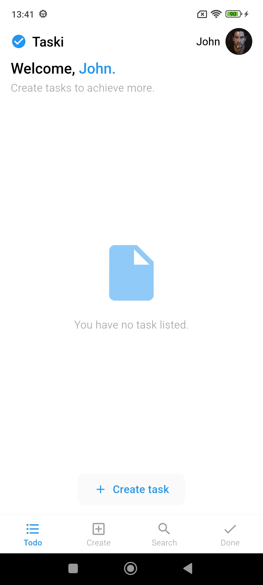
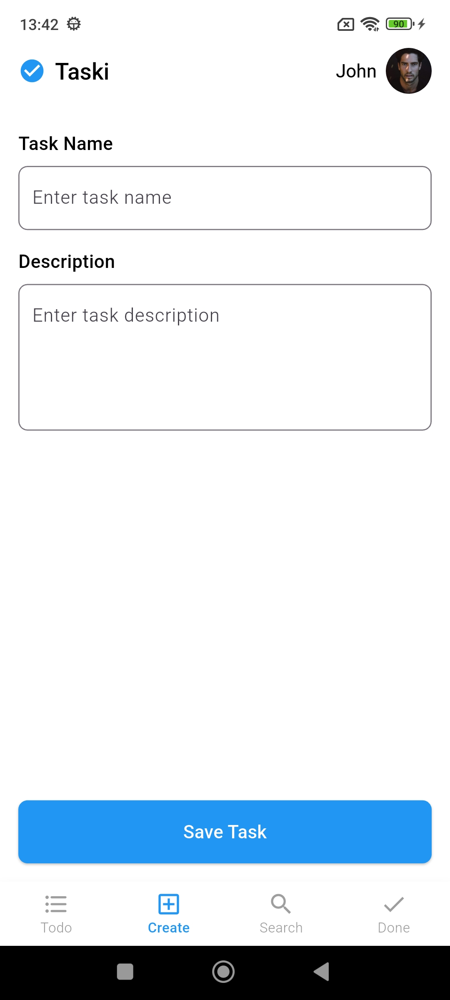
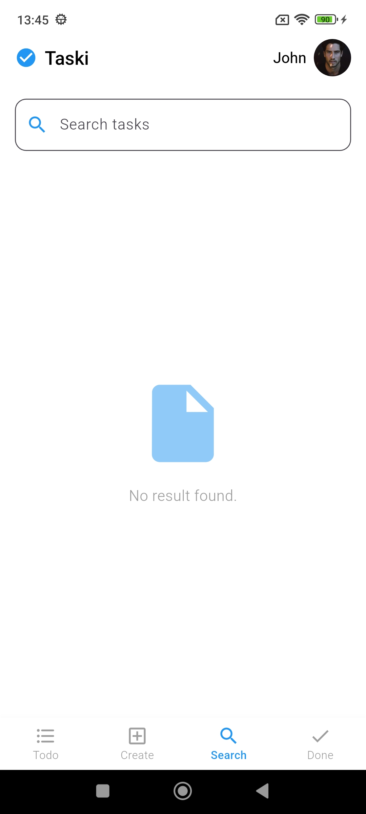
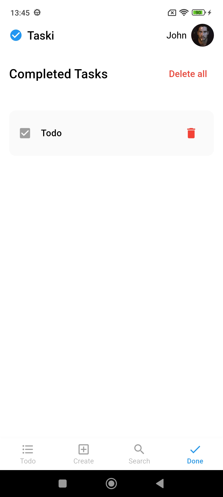
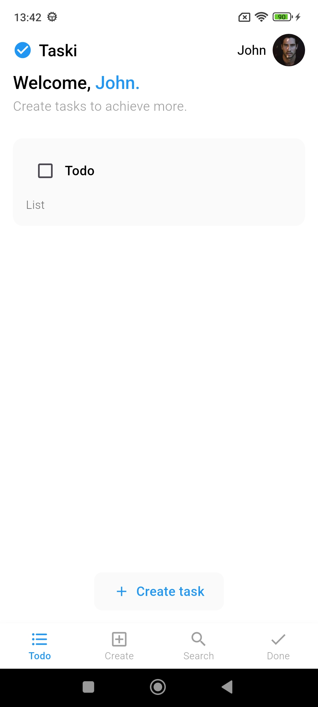

# 📌 Task Manager

Task Manager é um aplicativo desenvolvido em **Flutter** que permite criar, listar e gerenciar tarefas de forma intuitiva e eficiente. O projeto segue o conceito **Offline First**, garantindo que as tarefas sejam salvas no **SQLite** mesmo sem conexão com a internet.

## 🚀 Funcionalidades
- 📋 **Listagem de Tarefas**: Exibe todas as tarefas pendentes com rolagem infinita.
- ✅ **Marcar como concluída**: Permite marcar uma tarefa como feita, movendo-a para a aba de tarefas concluídas.
- 📝 **Criar nova tarefa**: Adicione um título e descrição para uma nova tarefa.
- 🔎 **Pesquisa de tarefas**: Busque rapidamente por uma tarefa específica.
- 🗑️ **Excluir tarefas**: Remova tarefas individuais ou limpe todas as concluídas.

## 📂 Estrutura do Projeto
O projeto segue o padrão de arquitetura **MVVM (Model-View-ViewModel)**, organizado da seguinte forma:
```
lib/
 ├── core/              
 ├── models/            
 ├── views/             
 ├── viewmodels/  
 ├── main.dart          
 ├── app.dart 
```

## 🛠️ Tecnologias Utilizadas
- **Flutter** (Dart)
- **SQLite** (Persistência de dados offline)
- **Provider** (Gerenciamento de estado)

## 📦 Requisitos
Antes de rodar o projeto, certifique-se de ter instalado:
- Flutter SDK [Baixar aqui](https://flutter.dev/docs/get-started/install)
- Android Studio ou Visual Studio Code com a extensão Flutter
- Um dispositivo físico ou emulador configurado

## 🚀 Como Executar o Projeto
1. Clone o repositório:
   ```sh
   git clone https://github.com/seu-usuario/task_manager.git
   ```
2. Acesse a pasta do projeto:
   ```sh
   cd task_manager
   ```
3. Instale as dependências:
   ```sh
   flutter pub get
   ```
4. Execute o aplicativo:
   ```sh
   flutter run
   ```

## 📸 Screenshots














## 📩 Contato
Se precisar de ajuda, entre em contato:
📧 **Seu Email**: alefy_sx@hotmail.com  
💼 **LinkedIn**: [seu-linkedin](https://www.linkedin.com/in/alefy-xavier-developer/)

